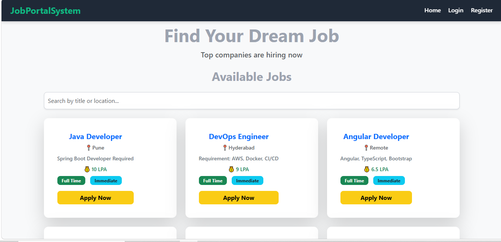
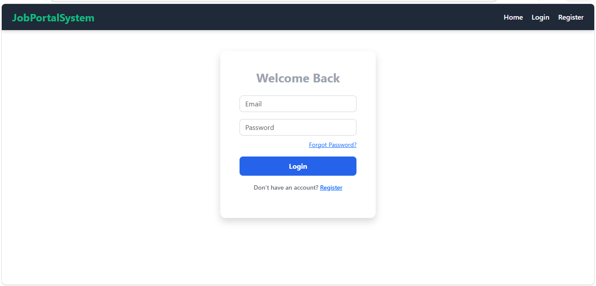
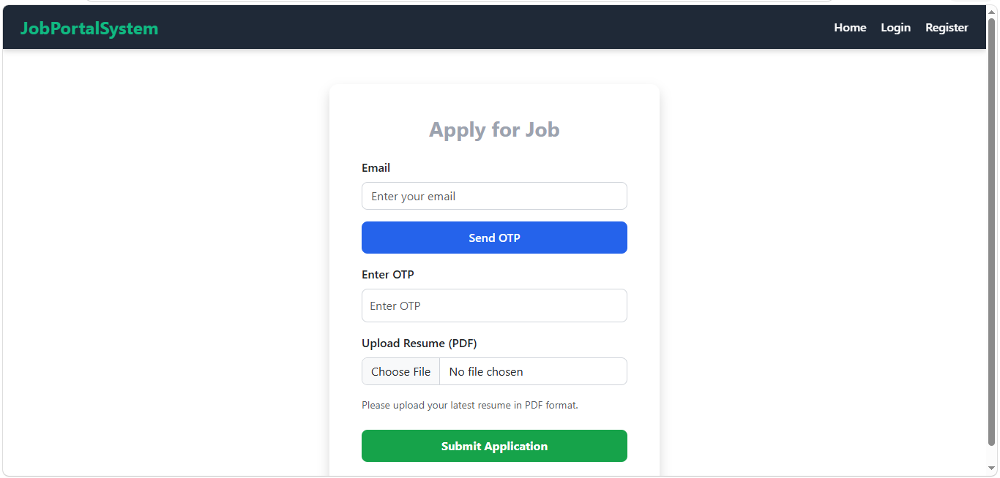
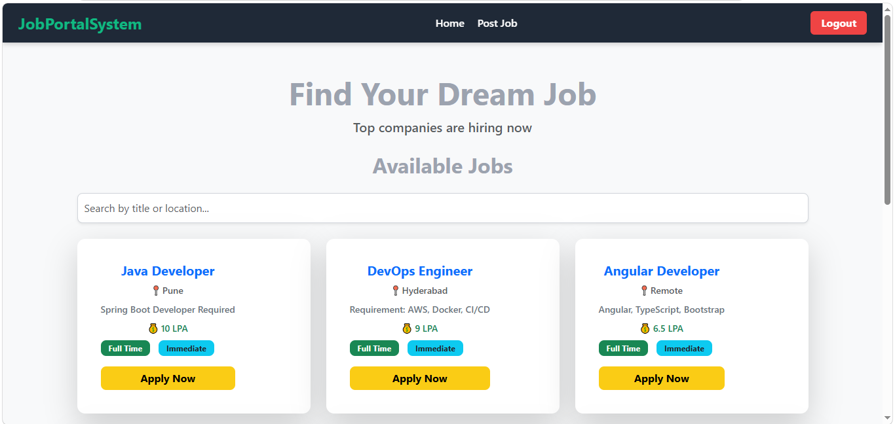
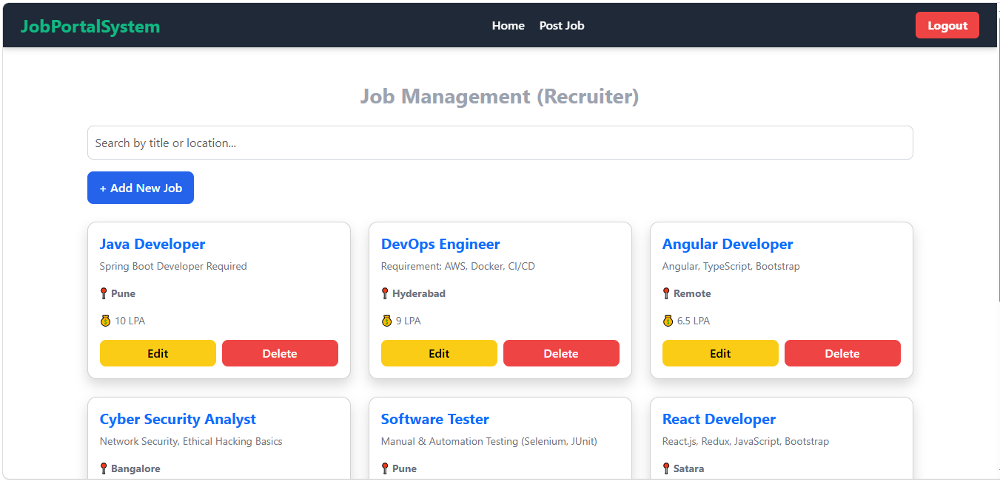

# Job Portal System

A full-stack Job Portal web application developed using React.js, Spring Boot, Spring Security, and MySQL.

## 🚀 Features

### 👤 Job Seeker

- User registration and login
- Secure authentication
- Browse and search available jobs
- Apply for jobs
- Upload resume while applying
- Track application status
- View applied jobs

### 🏢 Recruiter

- Recruiter registration and login
- Post new job openings
- View posted jobs
- Manage job postings
- View job applications
- Update application status

### 🛡️ Admin

- Role-based access
- Manage users
- Manage jobs
- Manage recruiters
- Manage applications

## 🔐 Security

- Spring Security authentication
- Role-based authorization
- Password encryption using BCrypt
- OTP-based email verification
- Protected REST APIs
  ## 🛠️ Technologies Used

### Frontend

- React.js
- JavaScript
- HTML5
- CSS3
- Bootstrap
- Axios

### Backend

- Java
- Spring Boot
- Spring MVC
- Spring Security
- Spring Data JPA
- Hibernate
- REST APIs
- Maven

### Database

- MySQL

### Tools

- IntelliJ IDEA / Eclipse
- Visual Studio Code
- Postman
- XAMPP
- Git & GitHub

## 📂 Project Structure

```text
Job-Portal-System
│
├── Backend
│   └── JobPortalProject-1
│       ├── src
│       ├── pom.xml
│       └── ...
│
├── Frontend
│   ├── public
│   ├── src
│   ├── package.json
│   └── ...
│
├── Database
│   └── job_portal.sql
│
├── Screenshots
│   ├── home-page.png
│   ├── login-page.png
│   ├── registration-page.png
│   ├── jobseeker-dashboard.png
│   ├── apply-for-job.png
│   ├── recruiter-dashboard.png
│   └── post-job.png
│
└── .gitignore
DATABASE

The project uses MySQL database named: job_portal

The database SQL file is available in the Database folder.

REST API

The backend provides REST APIs for:

• User registration and login
• OTP verification
• Job management
• Job applications
• Recruiter operations
• Admin operations
• Resume upload

APIs were tested using Postman.

HOW TO RUN THE PROJECT

1. Setup MySQL Database

Start MySQL using XAMPP or MySQL Server.

Create a database named job_portal.

Import Database/job_portal.sql into MySQL/phpMyAdmin.

2. Run Backend

Open Backend/JobPortalProject-1

Run the Spring Boot application.

Backend URL: http://localhost:8081

3. Run Frontend

Open a terminal inside Frontend.

Run:

npm install

Then:

npm start

Frontend URL: http://localhost:3000

## 📸 Screenshots

### Home Page


### Login Page


### Registration Page


### Job Seeker Dashboard


### Apply for Job


### Recruiter Dashboard


### Post Job


PROJECT HIGHLIGHTS

• Full-stack web application
• RESTful API architecture
• Role-based access control
• Secure authentication and authorization
• OTP email verification
• Resume upload functionality
• Job posting and application management
• MySQL relational database
• React and Spring Boot integration

DEVELOPER

Pratiksha Bhise

Java Full Stack Developer | Fresher

Technical Skills

• Java
• Spring Boot
• React.js
• SQL
• MySQL
• REST APIs
• Spring Security

FUTURE ENHANCEMENTS

• Online interview scheduling
• Job recommendations
• Email notifications
• Advanced job filtering
• Recruiter analytics dashboard
• Cloud deployment


